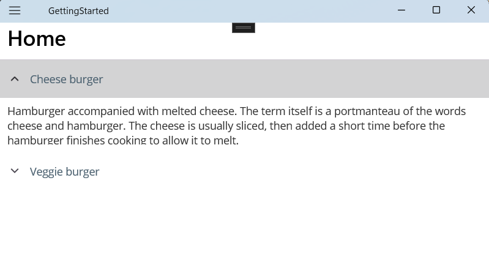

# How to customize the header icon in .NET MAUI SfAccordion
This demo shows how to customize the header icon in .NET MAUI SfAccordion.

This article illustrates how to customize the header icon on [.NET MAUI SfAccordion](https://www.syncfusion.com/maui-controls/maui-accordion). In this example, we will customize the header icon on the SfAccordion.

The [SfAccordion](https://help.syncfusion.com/maui/accordion/getting-started) control is properly initialized with the necessary properties. To customize the appearance of the header icon, you can enable and set the `HeaderIconPosition` property, which allows you to change the position of the icon displayed in the header. We can set it by using `Start` and `End` values.

**XAML:**

 ```xml
   <ContentPage.Content>
    <syncfusion:SfAccordion HeaderIconPosition="Start" >
        <syncfusion:SfAccordion.Items>
            <syncfusion:AccordionItem>
                <syncfusion:AccordionItem.Header>
                    <Grid>
                        <Label TextColor="#495F6E" Text="Cheese burger" HeightRequest="50" VerticalTextAlignment="Center"/>
                    </Grid>
                </syncfusion:AccordionItem.Header>
                <syncfusion:AccordionItem.Content>
                    <Grid Padding="10,10,10,10" BackgroundColor="#FFFFFF">
                        <Label TextColor="#303030" Text="Hamburger accompanied with melted cheese. The term itself is a portmanteau of the words cheese and hamburger. The cheese is usually sliced, then added a short time before the hamburger finishes cooking to allow it to melt." HeightRequest="50" VerticalTextAlignment="Center"/>
                    </Grid>
                </syncfusion:AccordionItem.Content>
            </syncfusion:AccordionItem>
            <syncfusion:AccordionItem>
                <syncfusion:AccordionItem.Header>
                    <Grid>
                        <Label TextColor="#495F6E" Text="Veggie burger" HeightRequest="50" VerticalTextAlignment="Center"/>
                    </Grid>
                </syncfusion:AccordionItem.Header>
                <syncfusion:AccordionItem.Content>
                    <Grid Padding="10,10,10,10" BackgroundColor="#FFFFFF">
                        <Label TextColor="#303030" Text="Veggie burger, garden burger, or tofu burger uses a meat analogue, a meat substitute such as tofu, textured vegetable protein, seitan (wheat gluten), Quorn, beans, grains or an assortment of vegetables, which are ground up and formed into patties." HeightRequest="50" VerticalTextAlignment="Center"/>
                    </Grid>
                </syncfusion:AccordionItem.Content>
            </syncfusion:AccordionItem>
        </syncfusion:SfAccordion.Items>
    </syncfusion:SfAccordion>
</ContentPage.Content>
 ```



 Download the complete sample from [GitHub](https://github.com/SyncfusionExamples/How-to-customize-the-header-icon-in-.NET-MAUI-SfAccordion/pull/1)
